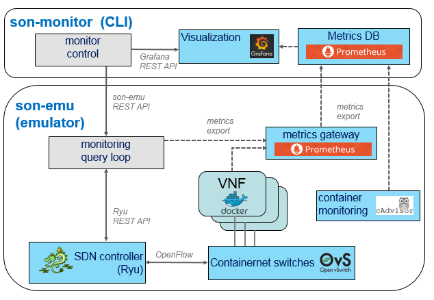

# son-monitor

Monitor metrics of a deployed service (from the SONATA SDK emulator or Service Platform).
Generate and/or export metrics that are useful for debugging and analyzing the service performance.

Below figure shows the architecture of the son-monitor tools inside the total SONATA SDK:
- A set of monitoring functions implemented in son-emu
- External docker containers to gather and store metrics (cAdvisor, Prometheus)
- Metric install and retrieval functions inside son-cli



### Initialize the monitoring framework
The monitoring framework can be initialized with this command. It starts several Docker containers in the SDK environment (cAdvisor and Prometheus DB).
```
usage: son-monitor init [-h] [{start,stop}]

start(default)/stop the monitoring framework

positional arguments:
  {start,stop}  start: start the monitoring framework (cAdvisor, Prometheus DB + Pushgateway)
                stop: stop the monitoring framework

optional arguments:
  -h, --help    show this help message and exit
```

### Export metrics through the MSD file
```
usage: son-monitor msd [-h] --file FILE [{start,stop}]

start(default)/stop monitoring metrics from the msd (monitoring descriptor file)

positional arguments:
  {start,stop}          start/stop monitoring metrics from the msd (monitoring descriptor file)

optional arguments:
  -h, --help            show this help message and exit
  --file FILE, -f FILE  Monitoring Service Descriptor file (MSD) describing the monitoring rules
```
This command installs the metrics defined in a monitoring specific descriptor file 
and starts all the related docker files (Grafana, Prometheus DB). A new Grafana dashboard is started where the defined metrics are shown.
This is the recommended usage for son-monitor. More info on the [msd file](https://github.com/sonata-nfv/son-cli/wiki/son-monitor:-msd-file) documentation on the wiki.
```
son-monitor msd -f file.yml
```
### Stream metrics from the SONATA Service Platform
```
usage: son-monitor stream [-h] [--metric METRIC] [--vnf_id VNF_NAME]
                          [--service SERVICE] [--sp SP]
                          [{start,stop}]

Stream monitor data from the SONATA Service Platform. (Authentication must be configured first via son-access)

positional arguments:
  {start,stop}          start/stop streaming metrics

optional arguments:
  -h, --help            show this help message and exit
  --metric METRIC, -me METRIC
                        SP metric
  --vnf_id VNF_NAME, -vnf VNF_NAME
                        vnf_id to be monitored
  --service SERVICE, -s SERVICE
                        Service name that includes the VNT to be monitored
  --sp SP, -sp SP       Service Platform ID where the service is instantiated
```

### Query metrics
Metrics can be queried from both the emulator in the SDK and the SONATA Service Platform.
```
usage: son-monitor query [-h] [--vim VIM] [--datacenter DATACENTER]
                         [--vnf_id VNF_NAME] [--service SERVICE]
                         [--metric METRIC] [--query QUERY]

query monitored metrics from the Prometheus DB in the SDK or the Service Platform

optional arguments:
  -h, --help            show this help message and exit
  --vim VIM, -vim VIM   Emulator or Service Platform ID where the service is instantiated (default = emulator)
  --datacenter DATACENTER, -d DATACENTER
                        Data center where the vnf is deployed (if not given, the datacenter will be looked up first)
  --vnf_id VNF_NAME, -vnf VNF_NAME
                        vnf name:interface to be monitored
  --service SERVICE, -s SERVICE
                        Service name that includes the VNT to be monitored
  --metric METRIC, -me METRIC
                        The metric in the SDK or SP to query
  --query QUERY, -q QUERY
                        raw prometheus query
```
*Example*:  Send a query to the prometheus DB to retrieve the earlier exposed metrics, or default metric exposed by cAdvisor.
The Prometheus query language can be used.
```
son-monitor query --vim emu -d datacenter1 -vnf vnf1 -q 'sum(rate(container_cpu_usage_seconds_total{id="/docker/<uuid>"}[10s]))'
```

### Other features
This command starts an xterm for all deployed docker VNFs in son-emu (if no names are specified, xterms for all vnfs are started)
```
son-monitor xterm [-n vnf_names]
```

After a service has been deployed on the SDK emulator (son-emu), son-monitor can be used.
Son-monitor uses the son-emu rest api and Prometheus.

This command sniffs al the packets on a vnf interface 
(if no output is specified, tcpdump is started in an xterm window)
```
son-monitor dump -vnf vnf_name:interface [-f filename.pcap]
son-monitor dump stop
```


### Manual metrics export
The commands executed in the MSD file can also be executed separately:

*Example1*: Expose the tx_packets metric from son-emu network switch-port where vnf1 (default 1st interface) is connected.
The metric is exposed to the Prometheus DB.
```
son-monitor son-monitor interface start -vnf vnf1 -me tx_packets
```

*Example2*: Install a flow_entry in son-emu, monitor the tx_bytes on that flow_entry.
The metric is exposed to the Prometheus DB.
```
son-monitor flow_total start -src vnf1  -dst vnf2  -ma "dl_type=0x0800,nw_proto=17,udp_dst=5001"  -b -c 11 -me tx_bytes
```


